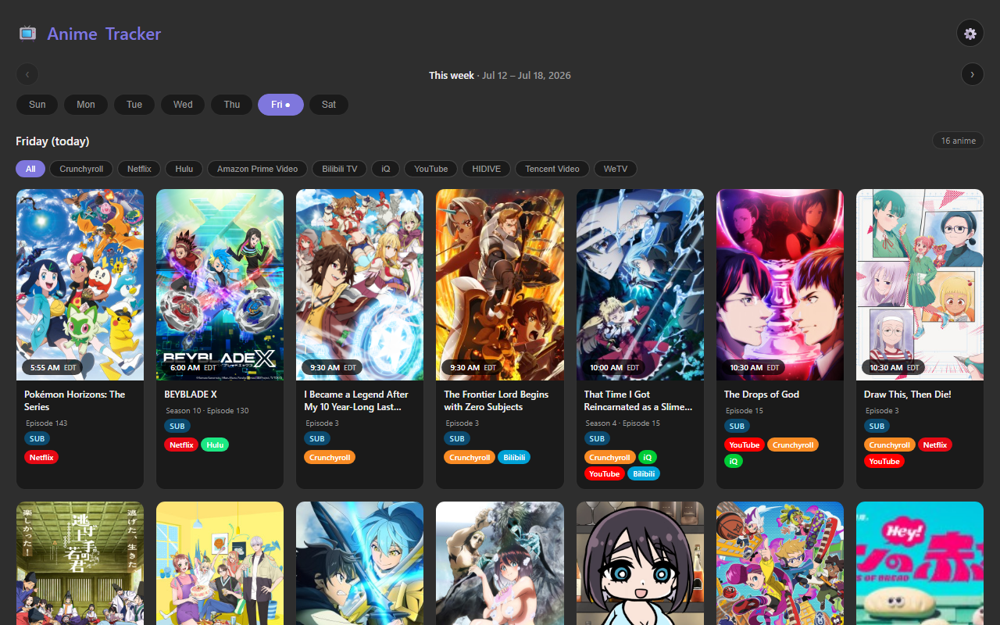

# Anime Tracker

A weekly anime new-episode airing tracker — track your watch list and see what's
airing this week, pulled live from AniList.



## Download

Grab the latest build from the **[Releases page](../../releases/latest)**:

| Platform | File | Notes |
|---|---|---|
| 🌐 Browser | `Anime-Tracker.html` | Open directly in any browser — no install |
| 🖥️ Windows | `Anime-Tracker.exe` | Standalone desktop app, no install needed |
| 📱 Android | `Anime-Tracker-Android.apk` | Sideload on your phone |

You can also **[try it live in your browser](https://tatsuota.github.io/portfolio/downloads/Anime-Tracker.html)** —
no download at all.

## Running each platform

### Browser (`web/`)
Double-click `web/anime-tracker.html` (or the downloaded `Anime-Tracker.html`) to
open it in your default browser. Works fully client-side; needs an internet
connection to pull the airing schedule from AniList.

### Windows desktop (`desktop/`)
Download `Anime-Tracker.exe` from the Releases page and double-click it — no
install, no Python required. It opens in its own native window (via the built-in
Edge WebView2 runtime) instead of a browser tab. See `desktop/README.txt` for
details.

### Android (`android/`)
Download `Anime-Tracker-Android.apk`, copy it to your phone, and open it to
install (allow "install from this source" when prompted).

## Build from source

### Desktop (Windows)
```powershell
cd desktop
python -m venv .venv
.venv\Scripts\pip install pywebview pyinstaller
.venv\Scripts\pyinstaller --noconfirm --onefile --windowed --name "Anime Tracker" ^
    --icon assets\anime-tracker.ico --add-data "anime-tracker.html;." ^
    src\anime_tracker_app.py
```
The built exe lands at `desktop/dist/Anime Tracker.exe`.

### Android
```bash
cd android
./gradlew assembleDebug   # or assembleRelease, with your own signing config
```
Requires Android Studio / the Android SDK (set `sdk.dir` in a local
`local.properties`, which is gitignored).

## Features

- Weekly airing calendar for your tracked anime, sourced live from AniList
- Add shows by search, mark episodes watched, see next air dates/times
- Runs as a plain web page, a native Windows app, or an Android app — same data
  model across all three
- Desktop and Android builds need no separate backend/server

## Tech

HTML/CSS/JS (vanilla) &middot; pywebview + PyInstaller (Windows desktop) &middot;
Android (Kotlin/Java, Gradle) &middot; AniList GraphQL API
